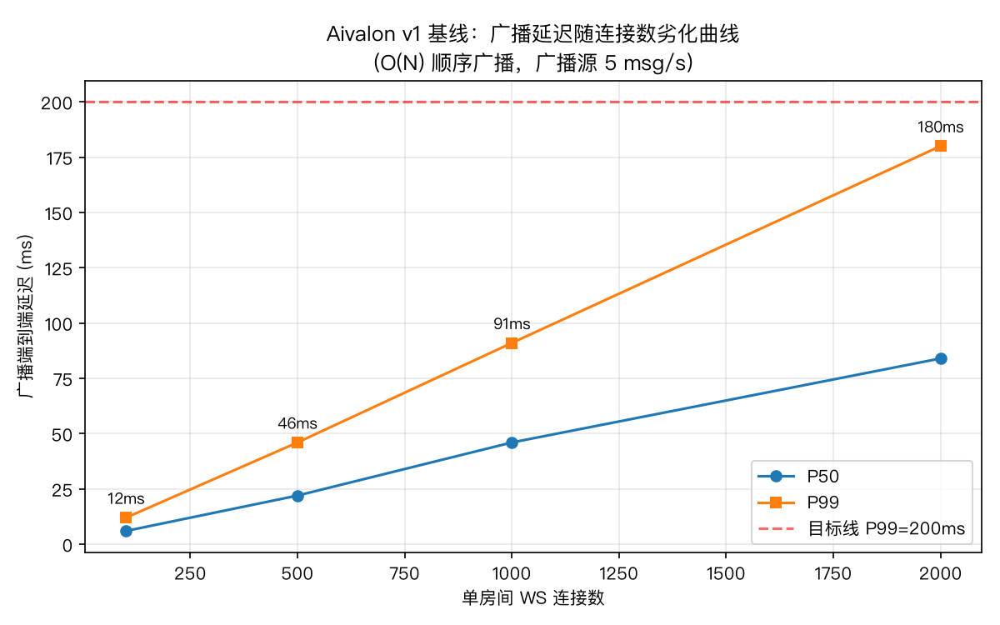

# Aivalon

基于 Vue 3 和 FastAPI 构建的 AI 阿瓦隆游戏平台。本项目旨在探索后端技术栈的落地实践，包括 WebSocket 实时对局、事件驱动架构、异步任务队列等。

## 技术栈

- **Frontend**: Vue 3, TypeScript, Vite, TailwindCSS (计划中)
- **Backend**: Python 3.10+, FastAPI, Pydantic, SQLAlchemy
- **Infrastructure**: MySQL 8.0, Redis, RabbitMQ (via Docker Compose)
- **Observability**: Prometheus + Grafana（声明式预置，随 compose 一键启动）
- **Benchmark**: Locust 压测平台（`bench/`，5 类标准场景）

## 性能基线（v1，压测驱动优化对照组）

v2 架构升级以实测基线为依据推进。关键基线数据（单节点，i7-9750H / 32GB）：

- 读接口容量拐点 **~340 RPS**；对局动作 P50 ~40ms（10 并发房间）
- WebSocket **2000 并发连接零失败**（修复连接池雪崩后，见 `document/DEVLOG.md` 006）
- 广播延迟随连接数近线性劣化（O(N) 顺序广播），是网关重构的靶子：



完整数据与瓶颈分析：[document/benchmark/v1_baseline.md](document/benchmark/v1_baseline.md)


## 快速开始 (Quick Start)

本项目提供两种启动方式，建议开发时使用 **方式二**。

### 方式一：全 Docker 模式 (All-in-One)
适合快速预览或部署，无需配置本地 Python/Node 环境。

*(注：目前尚未配置应用层的 Dockerfile，此部分待完善，暂时仅启动中间件)*

```bash
# 启动所有基础设施（MySQL, Redis, RabbitMQ）
docker-compose up -d
```

### 方式二：混合开发模式 (推荐)
**基础设施跑在 Docker 中，业务代码跑在本地**。这样既能利用 Docker 管理中间件，又能享受 IDE 的代码热更新和调试功能。

#### 1. 启动基础设施
首先确保 Docker Desktop 已运行：
```bash
# 启动 MySQL, Redis, RabbitMQ
docker-compose up -d

# 检查服务状态
docker-compose ps
```

#### 2. 启动后端 (Backend)
```bash
cd backend

# 创建并激活虚拟环境
python -m venv venv
source venv/bin/activate  # Windows: venv\Scripts\activate

# 安装依赖
pip install -r requirements.txt

# 1. 启动 API 服务 (热更新模式)
# 默认运行在 http://localhost:8000
uvicorn app.main:app --reload

# 2. 启动 Celery Worker (异步任务)
# 负责处理 AI 思考、排行榜更新、邮件发送等耗时任务
# -A: 指定应用入口
# --loglevel: 日志级别
# --concurrency: 并发数 (建议根据 CPU 核数调整)
celery -A app.core.celery_app worker --loglevel=info --concurrency=4

# 3. 启动 Outbox Relay (消息转发器)
# 负责将数据库中的事件转发到消息队列 (可靠性保障)
python -m app.core.outbox_relay
```

#### 3. 启动前端 (Frontend)
```bash
cd frontend

# 安装依赖
npm install

# 启动开发服务器
# 默认运行在 http://localhost:5173
npm run dev
```

## ⚙️ 启动全栈 (开发模式)

### 方式一：一键启动 (推荐)

我们提供了一个脚本 `dev_runner.py` 来同时启动 API、Celery 和 Relay 服务。

1. **Terminal 1 (Infrastructure)**: `docker-compose up`
2. **Terminal 2 (Backend All-in-One)**: 
   ```bash
   cd backend
   python dev_runner.py
   ```
3. **Terminal 3 (Frontend)**: `npm run dev`

### 方式二：手动分步启动

如果需要单独调试某个服务，可以在不同终端分别启动：

1. **Terminal 1 (Infrastructure)**: `docker-compose up`
2. **Terminal 2 (API)**: `uvicorn app.main:app --reload`
3. **Terminal 3 (Celery)**: `celery -A app.core.celery_app worker --loglevel=info`
4. **Terminal 4 (Relay)**: `python -m app.core.outbox_relay`
5. **Terminal 5 (Frontend)**: `npm run dev`

## ⚙️ 环境配置 (.env)

项目根目录下的 `.env` 文件用于配置基础设施的环境变量。默认配置开箱即用（配合 Docker）：

```ini
# MySQL
MYSQL_ROOT_PASSWORD=root_password
MYSQL_DATABASE=aivalon
MYSQL_USER=aivalon_user
MYSQL_PASSWORD=aivalon_password

# RabbitMQ
RABBITMQ_DEFAULT_USER=guest
RABBITMQ_DEFAULT_PASS=guest
```

## 目录结构

```
.
├── backend/          # FastAPI 后端工程
├── frontend/         # Vue 3 前端工程
├── document/         # 项目文档 (PRD, Todo)
├── docker-compose.yml # 基础设施编排
└── .env              # 环境变量
```

## 开发指南

- **API 文档**: 启动后端后访问 `http://localhost:8000/docs`
- **RabbitMQ 管理**: `http://localhost:15672` (guest/guest)
